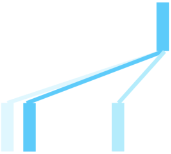
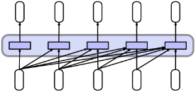
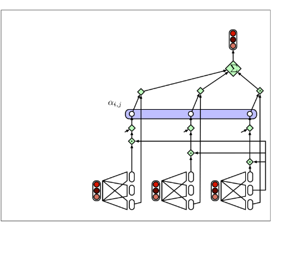
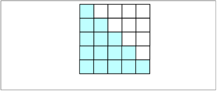
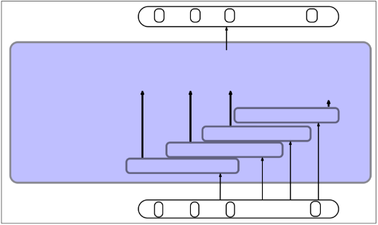
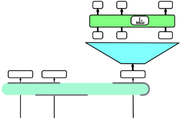
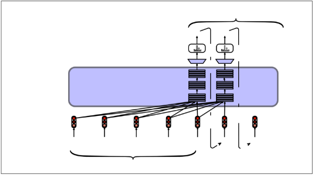
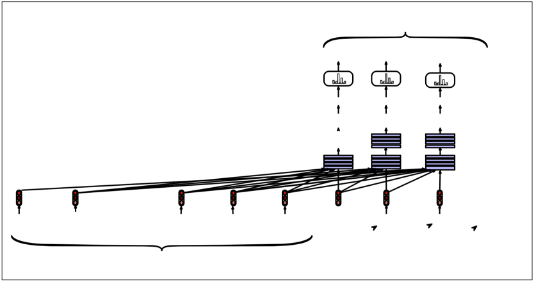

Speech and Language Processing. Daniel Jurafsky & James H. Martin. Copyright © 2023. All rights reserved. Draft of February 3, 2024.

CHAPTER 

10 TLarransfgeormersLanguage Models and

“How much do we know at any time? Much more, or so I believe, than we know we know.”

Agatha Christie, The Moving Finger

Fluent speakers of a language bring an enormous amount of knowledge to bear dur- ing comprehension and production. This knowledge is embodied in many forms, perhaps most obviously in the vocabulary, the rich representations we have of words and their meanings and usage. This makes the vocabulary a useful lens to explore the acquisition of knowledge from text, by both people and machines.

Estimates of the size of adult vocabularies vary widely both within and across languages. For example, estimates of the vocabulary size of young adult speakers of American English range from 30,000 to 100,000 depending on the resources used to make the estimate and the definition of what it means to know a word. What is agreed upon is that the vast majority of words that mature speakers use in their day-to-day interactions are acquired early in life through spoken interactions with care givers and peers, usually well before the start of formal schooling. This active vocabularyisextremelylimitedcomparedtothesizeoftheadultvocabulary(usually on the order of 2000 words for young speakers) and is quite stable, with very few additional words learned via casual conversation beyond this early stage. Obviously, this leaves a very large number of words to be acquired by other means.

A simple consequence of these facts is that children have to learn about 7 to 10 words a day, every single day, to arrive at observed vocabulary levels by the time they are 20 years of age. And indeed empirical estimates of vocabulary growth in late elementary through high school are consistent with this rate. How do children achievethisrateofvocabularygrowth? Mostofthisgrowthisnothappeningthrough direct vocabulary instruction in school, which is not deployed at the rate that would be required to result in sufficientvocabulary growth.

The most likely explanation is that the bulk of this knowledge acquisition hap- pens as a by-product of reading, as part of the rich processing and reasoning that we perform when we read. Research into the average amount of time children spend reading, and the lexical diversity of the texts they read, indicate that it is possible to achieve the desired rate. But the mechanism behind this rate of learning must be remarkable indeed, since at some points during learning the rate of vocabulary growth exceeds the rate at which new words are appearing to the learner!

Many of these facts have motivated approaches to word learning based on the distributional hypothesis, introduced in Chapter 6. This is the idea that something about what we’re loosely calling word meanings can be learned even without any grounding in the real world, solely based on the content of the texts we encounter over our lives. This knowledge is based on the complex association of words with the words they co-occur with (and with the words that those words occur with).

The crucial insight of the distributional hypothesis is that the knowledge that we acquire through this process can be brought to bear long after its initial acquisition.

Of course, adding grounding from vision or from real-world interaction can help

build even more powerful models, but even text alone is remarkably useful.           pretraining Inthischapterweformalizethisideaofpretraining—learningknowledgeabout

language and the world from vast amounts of text—and call the resulting pretrained

language models large language models. Large language models exhibit remark-

able performance on all sorts of natural language tasks because of the knowledge

they learn in pretraining, and they will play a role throughout the rest of this book.

They have been especially transformative for tasks where we need to produce text,

like summarization, machine translation, question answering, or chatbots.

transformer Thestandardarchitectureforbuildinglargelanguagemodelsisthetransformer. We thus begin this chapter byintroducing thisarchitectureindetail. Thetransformer

makes use of a novel mechanism called self-attention, which developed out of the idea of attention that was introduced for RNNs in Chapter 9. Self-attention can be thought of a way to build contextual representations of a word’s meaning that integrate information from surrounding words, helping the model learn how words

relate to each other over large spans of text. We’llthenseehowtoapplythetransformertolanguagemodeling,inasettingof- ten called causal or autoregressive language models, in which we iteratively predict words left-to-right from earlier words. These language models, like the feedforward and RNN language models we have already seen, are thus self-trained: given a large corpus of text, we iteratively teach the model to guess the next word in the text from the prior words. In addition to training, we’ll introduce algorithms for generating

texts, including important methods like greedy decoding, beam search, and sam- pling. And we’ll talk about the components of popular large language models like

the GPT family.

Finally, we’ll see the great power of language models: almost any NLP task can be modeled as word prediction, if we think about it in the right way. We’ll work through an example of using large language models to solve one NLP task of summarization (generating a short text that summarizes some larger document). The use of a large language model to generate text is one of the areas in which the impact of the last decade of neural algorithms for NLP has been the largest. Indeed, text generation, along with image generation and code generation, constitute a new area of AI that is often called generative AI.

We’ll save three more areas of large language models for the next three chapters; Chapter 11 will introduce the bidirectional transformer encoder and the method of masked language modeling, used for the popular BERT family of models. Chap- ter 12 will introduce the most powerful way to interact with large language models: prompting them to perform other NLP tasks by simply giving directions or instruc- tions in natural language to a transformer that is pretrained on language modeling. And Chapter 13 will introduce the use of the encoder-decoder architecture for trans- formers in the context of machine translation.

1. The Transformer: A Self-Attention Network

transformer In this section we introduce the architecture of the transformer, the algorithm that

underlies most modern NLP systems. When used for causal language modeling, the input to a transformer is a sequence of words, and the output is a prediction for what word comes next, as well as a sequence of contextual embedding that represents the contextual meaning of each of the input words. Like the LSTMs of Chapter 9,

1. • THE TRANSFORMER: A SELF-ATTENTION NETWORK 10

transformersareaneuralarchitecturethatcanhandledistantinformation. Butunlike LSTMs, transformers are not based on recurrent connections (which can be hard to parallelize), which means that transformers can be more efficient to implement at scale.

Transformers are made up of stacks of transformer blocks, each of which is a multilayer network that maps sequences of input vectors (x1;:::;xn) to sequences of

output vectors (z1;:::;zn) of the same length. These blocks are made by combin- self-attention ing simple linear layers, feedforward networks, and self-attention layers, the key innovation of transformers. Self-attention allows a network to directly extract and

use information from arbitrarily large contexts. We’ll start by describing how self- attention works and then return to how it fitsinto larger transformer blocks. Finally, we’ll describe how to use the transformer block together with some input and output mechanisms as a language model, to predict upcoming words from prior words in

the context.

1. Transformers: the intuition

The intuition of a transformer is that across a series of layers, we build up richer and richer contextualized representations of the meanings of input words or tokens (we will refer to the input as a sequence of words for convenience, although technically the input is firsttokenized by an algorithm like BPE, so it is a series of tokens rather than words). At each layer of a transformer, to compute the representation of a word i we combine information from the representation of i at the previous layer with information from the representations of the neighboring words. The goal is to produceacontextualizedrepresentationforeachwordateachposition. Wecanthink of these representations as a contextualized version of the static vectors we saw in Chapter6, whicheachrepresentedthemeaningofawordtype. Bycontrast, ourgoal in transformers is to produce a contextualized version, something that represents what this word means in the particular context in which it occurs.

We thus need a mechanism that tells us how to weigh and combine the represen- tations of the different words from the context at the prior level in order to compute our representation at this layer. This mechanism must be able to look broadly in the context, since words have rich linguistic relationships with words that can be many sentences away. Even within the sentence, words have important linguistic relation- ships with contextual words. Consider these examples, each exhibiting linguistic relationships that we’ll discuss in more depth in later chapters:

(10.1) The keys to the cabinet are on the table.

(10.2) The chicken crossed the road because it wanted to get to the other side.

(10.3) I walked along the pond, and noticed that one of the trees along the bank

had fallen into the water after the storm.

In [(10.1](#_page2_x160.20_y549.28)), the phrase The keysis the subject of the sentence, and in English and many languages, must agree in grammatical number with the verb are; in this case both are plural. In English we can’t use a singular verb like is with a plural sub- ject like keys; we’ll discuss agreement more in Chapter 17. In [(10.2](#_page2_x160.20_y564.51)), the pronoun it corefers to the chicken; it’s the chicken that wants to get to the other side. We’ll discuss coreference more in Chapter 26. In [(10.3](#_page2_x160.20_y580.00)), the way we know that bank refers to the side of a pond or river and not a financial institution is from the context, in- cluding words like pond and water. We’ll discuss word senses more in Chapter 23. These helpful contextual words can be quite far way in the sentence or paragraph,

so we need a mechanism that can look broadly in the context to help compute rep- resentations for words.

Self-attention is just such a mechanism: it allows us to look broadly in the con- text and tells us how to integrate the representation from words in that context from layer k1 to build the representation for words in layer k.

|
Layer 6 

self-attention distribution Layer 5
|
| - |

Figure 10.1 The self-attention weight distribution a that is part of the computation of therepresentation for the word it at layer 6. In computing the representation for it, we attend differently to the various words at layer 5, with darker shades indicating higher self-attention values. Note that the transformer is attending highly to animal, a sensible result, since in this example it corefers with the animal, and so we’d like the representation for it to draw on the representation for animal. Figure simplifiedfrom [(Uszkoreit, 2017](#_page29_x278.29_y382.63)).

Fig.[10.1](#_page3_x475.20_y283.62)showsanschematicexamplesimplifiedfromarealtransformer[(Uszko- reit, 2017](#_page29_x278.29_y382.63)). Here we want to compute a contextual representation for the word it, at layer 6 of the transformer, and we’d like that representation to draw on the represen- tations of all the prior words, from layer 5. The figure uses color to represent the attention distribution over the contextual words: the word animal has a high atten- tionweight, meaningthataswearecomputingtherepresentationforit, wewilldraw most heavily on the representation for animal. This will be useful for the model to build a representation that has the correct meaning for it, which indeed is corefer- ent here with the word animal. (We say that a pronoun like it is coreferent with a noun like animal if they both refer to the same thing; we’ll return to coreference in Chapter 26.)

2. Causal or backward-looking self-attention

The concept of context can be used in two ways in self-attention. In causal, or backward looking self-attention, the context is any of the prior words. In general bidirectional self-attention, the context can include future words. In this chapter we focus on causal, backward looking self-attention; we’ll introduce bidirectional self-attention in Chapter 11.

Fig.[ 10.2 ](#_page4_x493.20_y196.82)thus illustrates the flow of information in a single causal, or backward looking, self-attention layer. As with the overall transformer, a self-attention layer maps input sequences (x1;:::;xn) to output sequences of the same length (a1;:::;an). When processing each item in the input, the model has access to all of the inputs up to and including the one under consideration, but no access to information about inputs beyond the current one. In addition, the computation performed for each item is independent of all the other computations. The firstpoint ensures that we can use this approach to create language models and use them for autoregressive generation, and the second point means that we can easily parallelize both forward inference and training of such models.

1. • THE TRANSFORMER: A SELF-ATTENTION NETWORK 10

|
**a**1 **a**2 **a**3 **a**4 **a**5

Self-Attention Layer 

**x**1 **x**2 **x**3 **x**4 **x**5
|
| - |

Figure 10.2 Information flow in a causal (or masked) self-attention model. In processingeach element of the sequence, the model attends to all the inputs up to, and including, the current one. Unlike RNNs, the computations at each time step are independent of all the other steps and therefore can be performed in parallel.

3. Self-attention more formally

We’ve given the intuition of self-attention (as a way to compute representations of a word at a given layer by integrating information from words at the previous layer) and we’ve defined context as all the prior words in the input. Let’s now introduce the self-attention computation itself.

The core intuition of attention is the idea of comparing an item of interest to a collection of other items in a way that reveals their relevance in the current context. In the case of self-attention for language, the set of comparisons are to other words (or tokens) within a given sequence. The result of these comparisons is then used to compute an output sequence for the current input sequence. For example, returning to Fig.[ 10.2,](#_page4_x493.20_y196.82) the computation of a3 is based on a set of comparisons between the input x3 and its preceding elements x1 and x2, and to x3 itself.

How shall we compare words to other words? Since our representations for words are vectors, we’ll make use of our old friend the dot product that we used for computing word similarity in Chapter 6, and also played a role in attention in Chapter 9. Let’s refer to the result of this comparison between words i and j as a score (we’ll be updating this equation to add attention to the computation of this score):

Verson 1: score(xi;xj) = xi xj (10.4)

The result of a dot product is a scalar value ranging from ¥ to ¥, the larger the value the more similar the vectors that are being compared. Continuing with our example, the first step in computing y3 would be to compute three scores: x3 x1, x3 x2 and x3 x3. Then to make effective use of these scores, we’ll normalize them with a softmax to create a vector of weights, aij, that indicates the proportional relevance of each input to the input element i that is the current focus of attention.

aij = softmax(score(xi;xj)) 8j i (10.5)

= ~~P~~iexp(score(xi;xj)) 8j i (10.6) k=1 exp(score(xi;xk))

Ofcourse, thesoftmaxweightwilllikelybehighestforthecurrentfocuselement i, since vecxi is very similar to itself, resulting in a high dot product. But other context words may also be similar to i, and the softmax will also assign some weight to those words.

Given the proportional scores in a , we generate an output value ai by summing

the inputs seen so far, each weighted by its a value.

X

ai = aijxj (10.7)

j i

The steps embodied in Equations[ 10.4 ](#_page4_x256.99_y501.02)through[ 10.7 ](#_page5_x276.72_y130.99)represent the core of an attention-based approach: a set of comparisons to relevant items in some context, a normalization of those scores to provide a probability distribution, followed by a weighted sum using this distribution. The output a is the result of this straightfor- ward computation over the inputs.

This kind of simple attention can be useful, and indeed we saw in Chapter 9 how to use this simple idea of attention for LSTM-based encoder-decoder models for machine translation. But transformers allow us to create a more sophisticated way of representing how words can contribute to the representation of longer inputs. Consider the three different roles that each input embedding plays during the course of the attention process.

- As the current focus of attention when being compared to all of the other

query preceding inputs. We’ll refer to this role as a query.

- In its role as a preceding input being compared to the current focus of atten-

key tion. We’ll refer to this role as a key.

value • And finally, as a value used to compute the output for the current focus of

attention.

To capture these three different roles, transformers introduce weight matrices WQ, WK, and WV. These weights will be used to project each input vector xi into

a representation of its role as a key, query, or value.

qi = xiWQ; ki = xiWK; vi = xiWV (10.8)

The inputs x and outputs y of transformers, as well as the intermediate vectors after the various layers like the attention output vector a, all have the same dimensionality 1d. We’ll have a dimension dk for the key and query vectors, and a separate dimension dv for the value vectors. In the original transformer work [(Vaswani et al., 2017](#_page29_x278.29_y414.01)), d was 512, dk and dv were both 64. The shapes of the transform matrices are then WQ 2 Rddk, WK 2 Rddk, and WV 2 Rddv.

Given these projections, the score between a current focus of attention, xi, and an element in the preceding context, xj, consists of a dot product between its query vector qi and the preceding element’s key vectors kj. This dot product has the right shape since both the query and the key are of dimensionality 1dk. Let’s update our previous comparison calculation to reflectthis, replacing Eq.[ 10.4 ](#_page4_x256.99_y501.02)with Eq.[ 10.9:](#_page5_x238.54_y590.37)

Verson 2: score(xi;xj) = qi kj (10.9)

The ensuing softmax calculation resulting in ai;j remains the same, but the output calculation for ai is now based on a weighted sum over the value vectors v.

X

ai = aijvj (10.10)

j i

Again, thesoftmaxweightaij willlikelybehighestforthecurrentfocuselement i, and so the value for yi will be most influenced by vi. But the model will also pay attention to other contextual words if they are similar to i, allowing their values to

1. • THE TRANSFORMER: A SELF-ATTENTION NETWORK 10

*a3*

Output of self-attention

6\. Sum the weighted value vectors

5\. Weigh each value vector

4\. Turn into weights via softmax

3\. Divide score by d k dk ÷ dk ÷ dk ÷

2\. Compare x3’s  *query* with the  *keys* for x1, x2, and x3

Wk k Wk k Wk k

1\. Generate  Wq q Wq q Wq q

key, query, value 

vectors *x1* Wv v *x2* Wv v *x3* Wv v

Figure 10.3 Calculating the value of a3, the third element of a sequence using causal (left-to-right) self-attention.

also influencethe finalvalue of vj. Context words that are not similar to i will have their values downweighted and won’t contribute to the finalvalue.

There is one final part of the self-attention model. The result of a dot product can be an arbitrarily large (positive or negative) value. Exponentiating large values can lead to numerical issues and to an effective loss of gradients during training. To avoid this, we scale down the result of the dot product, by dividing it by a factor related to the size of the embeddings. A typical approach is to divide by the square root of the dimensionality of the query and key vectors (dk), leading us to update our scoring function one more time, replacing Eq.[ 10.4 ](#_page4_x256.99_y501.02)and Eq.[ 10.9 ](#_page5_x238.54_y590.37)with Eq.[ 10.12. ](#_page6_x258.39_y553.41)Here’s a finalset of equations for computing self-attention for a single self-attention output vector ai from a single input vector xi, illustrated in Fig.[ 10.3 ](#_page6_x493.20_y353.37)for the case of calculating the value of the third output a3 in a sequence.

qi = xiWQ;ki = xiWK;vi = xiWV (10.11) Final verson: score(xi;xj) = q~~p~~i kj (10.12) dk

aij = softmax(score(xi;xj)) 8j i (10.13)

X

ai = aijvj (10.14)

j i

4. Parallelizing self-attention using a single matrix X

This description of the self-attention process has been from the perspective of com- puting a single output at a single time step i. However, since each output, yi, is computed independently, this entire process can be parallelized, taking advantage of

efficient matrix multiplication routines by packing the input embeddings of the N tokens of the input sequence into a single matrix X 2 RNd. That is, each row of X

is the embedding of one token of the input. Transformers for large language models can have an input length N = 1024, 2048, or 4096 tokens, so X has between 1K and 4K rows, each of the dimensionality of the embedding d.

We then multiply X by the key, query, and value matrices (all of dimensionality dd) to produce matrices Q 2 RNd, K 2 RNd, and V 2 RNd, containing all the

key, query, and value vectors:

Q = XWQ; K = XWK; V = XWV (10.15)

Giventhesematriceswecancomputealltherequisitequery-keycomparisonssimul- taneously by multiplying Q and K| in a single matrix multiplication (the product is

of shape NN; Fig.[ 10.4 ](#_page7_x475.20_y600.00)shows a visualization). Taking this one step further, we can scale these scores, take the softmax, and then multiply the result by V resulting in a matrix of shape Nd: a vector embedding representation for each token in the input. We’ve reduced the entire self-attention step for an entire sequence of N tokens to the following computation:

QK|

A = SelfAttention(Q;K;V) = softmax ~~p~~ V (10.16)

dk

5. Masking out the future

The self-attention computation as we’ve described it has a problem: the calculation inQK| resultsinascoreforeachqueryvaluetoeverykeyvalue,includingthosethat

follow the query. This is inappropriate in the setting of language modeling: guessing the next word is pretty simple if you already know it! To fixthis, the elements in the upper-triangular portion of the matrix are zeroed out (set to ¥), thus eliminating any knowledge of words that follow in the sequence. Fig.[ 10.4 ](#_page7_x475.20_y600.00)shows this masked QK| matrix. (we’ll see in Chapter 11 how to make use of words in the future for tasks that need it).

q1•k1 −∞ −∞ −∞ −∞

q2•k1 q2•k2 −∞ −∞ −∞ N q3•k1 q3•k2 q3•k3 −∞ −∞

q4•k1 q4•k2 q4•k3 q4•k4 −∞

q5•k1 q5•k2 q5•k3 q5•k4 q5•k5

N

Figure 10.4 The NN QK| matrix showing the qi kj values, with the upper-triangleportion of the comparisons matrix zeroed out (set to ¥, which the softmax will turn to zero).

Fig.[ 10.4 ](#_page7_x475.20_y600.00)also makes it clear that attention is quadratic in the length of the input, since at each layer we need to compute dot products between each pair of tokens in the input. This makes it expensive for the input to a transformer to consist of very long documents (like entire novels). Nonetheless modern large language models manage to use quite long contexts of up to 4096 tokens.

2. • MULTIHEAD ATTENTION 9
2. Multihead Attention

Transformers actually compute a more complex kind of attention than the single self-attention calculation we’ve seen so far. This is because the different words in a sentence can relate to each other in many different ways simultaneously. For exam- ple, distinct syntactic, semantic, and discourse relationships can hold between verbs and their arguments in a sentence. It would be difficult for a single self-attention model to learn to capture all of the different kinds of parallel relations among its in-

self-attentionmultihead puts. Transformers address this issue with multihead self-attention layers. These layers are sets of self-attention layers, called heads, that reside in parallel layers at the same

depth in a model, each with its own set of parameters. By using these distinct sets of

parameters, each head can learn different aspects of the relationships among inputs

at the same level of abstraction.

To implement this notion, each head, i, in a self-attention layer is provided with its own set of key, query and value matrices: WK, WQ and WV. These are used

i i i

to project the inputs into separate key, value, and query embeddings separately for each head, with the rest of the self-attention computation remaining unchanged.

Inmulti-headattention,aswithself-attention,themodeldimensiond isstillused for the input and output, the key and query embeddings have dimensionality dk, and the value embeddings are of dimensionality dv (again, in the original transformer paper d = dv = 64, h = 8, and d = 512). Thus for each head i, we have weight

layers Wk Q 2 Rddk, WK 2 Rddk, and WV 2 Rddv, and these get multiplied by the inputs packed into Xi to produce Q 2 RiNdk, K 2 RNdk, and V 2 RNdv. The

i

output of each of the h heads is of shape Ndv, and so the output of the multi-head layer with h heads consists of h matrices of shape Ndv. To make use of these matrices in further processing, they are concatenated to produce a single output with

O dimensionality Nhdv. Finally, we use yet another linear projection W 2 Rhdvd,

that reshape it to the original output dimension for each token. Multiplying the concatenated Nhdv matrix output by WO 2 Rhdvd yields the self-attention output

A of shape [Nd], suitable to be passed through residual connections and layer norm.

Q = XWQ ; K = XWK ; V = XWV

i i i (10.17) headi = SelfAttention(Q;K;V) (10.18)

A = MultiHeadAttention(X) = (head1 head2:::headh)WO (10.19)

Fig.[ 10.5 ](#_page9_x477.09_y327.25)illustrates this approach with 4 self-attention heads. In general in trans- formers, the multihead layer is used instead of a self-attention layer.

3. Transformer Blocks

The self-attention calculation lies at the core of what’s called a transformer block, which, in addition to the self-attention layer, includes three other kinds of layers: (1) a feedforward layer, (2) residual connections, and (3) normalizing layers (colloqui- ally called “layer norm”).

Fig.[ 10.6 ](#_page9_x475.20_y545.96)illustrates a standard transformer block consisting of a single attention layer followed by a position-wise feedforward layer with residual connections and layer normalizations following each.

[N x d] **a**1 **a**2 **a**3 … **a**N Project frhdv to dom **W**O  [hdv x d]

|
head1 output val

` `[N x dv]
|
head2 output val

` `[N x dv]
|
head3 output val

` `[N x dv]
|
head4 output val

` `[N x dv]
|
| - | - | - | - |

Concatenate

Outputs [N x hdv] 

**W**Q4, **W**K4, **W**V4  Head 4 Multihead   **W**Q3, **W**K3, **W**V3  Head 3

Attention Layer  **W**Q2, **W**K2, **W**V2  Head 2

with h=4 heads 

**W**Q1, **W**K1, **W**V1  Head 1

[N x d] **x**1 **x**2 **x**3 … **x**N

Figure 10.5 Multihead self-attention: Each of the multihead self-attention layers is provided with its ownset of key, query and value weight matrices. The outputs from each of the layers are concatenated and then projected to d, thus producing an output of the same size as the input so the attention can be followed by layer norm and feedforward and layers can be stacked.

<table><tr><th colspan="1" rowspan="2"></th><th colspan="2"></th><th colspan="2"></th></tr>
<tr><td colspan="8" valign="top"><b>h</b>1 <b>h</b>2 <b>h</b>3 … <b>h</b>n</td><td colspan="1"></td></tr>
<tr><td colspan="1" rowspan="3"></td><td colspan="3" rowspan="2"></td></tr>
<tr></tr>
<tr><td colspan="5">Feedforward …</td><td colspan="2"></td></tr>
<tr><td colspan="1"></td><td colspan="1"></td><td colspan="7" valign="bottom">z   z                                    zLayer Normalize</td><td colspan="1"></td></tr>
<tr><td colspan="1"></td><td colspan="1"></td><td colspan="5"></td><td colspan="2">+</td><td colspan="1"></td></tr>
<tr><td colspan="1"></td><td colspan="1"></td><td colspan="7" valign="top">
Residual

connection MultiHead Attention
</td><td colspan="1"></td></tr>
<tr><td colspan="1"></td><td colspan="8" valign="top"><b>x</b>1 <b>x</b>2 <b>x</b>3 … <b>x</b>n</td><td colspan="1"></td></tr>
<tr><td colspan="1">Figure 10.6</td></tr>
</table>

Feedforwardlayer ThefeedforwardlayercontainsNposition-wisenetworks,one at each position. Each is a fully-connected 2-layer network, i.e., one hidden layer, two weight matrices, as introduced in Chapter 7. The weights are the same for each position, but the parameters are different from layer to layer. Unlike attention, the feedforward networks are independent for each position and so can be computed in

parallel. It is common to make the dimensionality dff of the hidden layer of the feedforward network be larger than the model dimensionality d. (For example in the

original transformer model, d = 512 and dff = 2048.)

Residual connections Residual connections are connections that pass informa- tion from a lower layer to a higher layer without going through the intermediate

3. • TRANSFORMER BLOCKS 11

layer. Allowing information from the activation going forward and the gradient go- ing backwards to skip a layer improves learning and gives higher level layers direct access to information from lower layers [(He et al., 2016](#_page29_x72.42_y540.04)). Residual connections in transformers are implemented simply by adding a layer’s input vector to its out- put vector before passing it forward. In the transformer block shown in Fig.[ 10.6, ](#_page9_x475.20_y545.96)residual connections are used with both the attention and feedforward sublayers.

Layer Norm These summed vectors are then normalized using layer normaliza- layer norm tion [(Ba et al., 2016](#_page29_x72.42_y109.65)). Layer normalization (usually called layer norm) is one of

many forms of normalization that can be used to improve training performance in

deep neural networks by keeping the values of a hidden layer in a range that facil-

itates gradient-based training. Layer norm is a variation of the standard score, or

z-score, from statistics applied to a single vector in a hidden layer. The input to

layer norm is a single vector, for a particular token position i, and the output is that

vector normalized. Thus layer norm takes as input a single vector of dimensionality

d and produces as output a single vector of dimensionality d. The firststep in layer

normalization is to calculate the mean, m, and standard deviation, s , over the ele-

ments of the vector to be normalized. Given a hidden layer with dimensionality dh,

these values are calculated as follows.

d1 Xdh xi

sm == uuth 1i=1Xdh 2 (10.20)(10.21)

v

d (xi m)

h i=1

Given these values, the vector components are normalized by subtracting the mean from each and dividing by the standard deviation. The result of this computation is a new vector with zero mean and a standard deviation of one.

(xm)

^x = (10.22)

s

Finally, in the standard implementationoflayernormalization, twolearnableparam- eters, g and b, representing gain and offset values, are introduced.

LayerNorm = g ^x + b (10.23) Putting it all together The function computed by a transformer block can be ex-

pressed as:

O = LayerNorm(X+ SelfAttention(X)) (10.24) H = LayerNorm(O + FFN(O)) (10.25)

Or we can break it down with one equation for each component computation, using T (of shape [Nd]) to stand for transformer and superscripts to demarcate each computation inside the block:

T1 = SelfAttention(X) (10.26) T2 = X+ T1 (10.27) T3 = LayerNorm(T2) (10.28) T4 = FFN(T3) (10.29) T5 = T4 + T3 (10.30)

H = LayerNorm(T5) (10.31)

Crucially, the input and output dimensions of transformer blocks are matched so they can be stacked. Each token xi at the input to the block has dimensionality d, and so the input X and output H are both of shape [Nd].

Transformers for large language models stack many of these blocks, from 12 layers (used for the T5 or GPT-3-small language models) to 96 layers (used for GPT-3 large), to even more for more recent models. We’ll come back to this issues of stacking in a bit.

4. TheResidualStreamviewoftheTransformerBlock

The previous sections viewed the transformer block as applied to the entire N-token input X of shape [Nd], producing an output also of shape [Nd].

While packing everything this way is a computationally efficient way to imple- ment the transformer block, it’s not always the most perspicuous way to understand what the transformer is doing. It’s often clearer to instead visualize what is hap- pening to an individual token vector xi in the input as it is processed through each transformer block. After all, most of the components of the transformer are de- signed to take a single vector of dimensionality d, corresponding to a single token, and produce an output vector also of dimensionality d. For example, the feedfor- ward layer takes a single d-dimensional vector and produces a single d-dimensional vector. Over the N tokens in a batch, we simply use the identical feedforward layer weights(W1,W2, b1 andb2)foreachtokeni. Similarly, thelayernormfunctiontakes a single d-dimensional vector and produces a normalized d-dimensional version.

<table><tr><th colspan="1" rowspan="2"></th><th colspan="1" rowspan="2"></th><th colspan="41" rowspan="2" valign="top"><i>hi-1 hi hi+1</i></th><th colspan="7" rowspan="1"></th></tr>
<tr><td colspan="2" rowspan="1" valign="top"></td><td colspan="6"></td></tr>
<tr><td colspan="1" rowspan="3"></td><td colspan="1" rowspan="3"></td><td colspan="2" rowspan="3"></td><td colspan="2" rowspan="3"></td><td colspan="7" rowspan="3">Lay</td><td colspan="2"></td><td colspan="1" valign="top"></td><td colspan="19" rowspan="3">Norm</td><td colspan="2" rowspan="3"></td><td colspan="6" rowspan="3"></td><td colspan="7" rowspan="1"></td></tr>
<tr><td colspan="3">er </td></tr>
<tr><td colspan="2"></td><td colspan="1"></td></tr>
<tr><td colspan="1"></td><td colspan="1"></td><td colspan="2"></td><td colspan="2"></td><td colspan="7"></td><td colspan="4"></td><td colspan="6"></td><td colspan="16"></td><td colspan="2"></td><td colspan="6"></td><td colspan="5"></td></tr>
<tr><td colspan="1"></td><td colspan="1"></td><td colspan="2"></td><td colspan="2"></td><td colspan="7"></td><td colspan="2"></td><td colspan="1"></td><td colspan="5"></td><td colspan="1"></td><td colspan="3"></td><td colspan="8"></td><td colspan="11"></td></tr>
<tr><td colspan="1"></td><td colspan="1"></td><td colspan="2"></td><td colspan="2"></td><td colspan="7"></td><td colspan="2"></td><td colspan="1"></td><td colspan="5"></td><td colspan="11">Feedforward</td><td colspan="3"></td><td colspan="2"></td><td colspan="6"></td><td colspan="7"></td></tr>
<tr><td colspan="1" rowspan="3"></td><td colspan="1" rowspan="3"></td><td colspan="2" rowspan="3" valign="top">…</td><td colspan="2" rowspan="3"></td><td colspan="7"></td><td colspan="2"></td><td colspan="1"></td><td colspan="19" valign="top">Norm</td><td colspan="2"></td><td colspan="6" valign="top">…</td><td colspan="7"></td></tr>
<tr><td colspan="4">Lay</td><td colspan="2">er </td><td colspan="17" valign="top"></td><td colspan="5"></td><td colspan="7" valign="top"></td><td colspan="7"></td></tr>
<tr><td colspan="2"></td><td colspan="1"></td><td colspan="17" valign="top"></td><td colspan="2"></td><td colspan="10" valign="top"></td><td colspan="8"></td></tr>
<tr><td colspan="1"></td><td colspan="1"></td><td colspan="2"></td><td colspan="2"></td><td colspan="7"></td><td colspan="4"></td><td colspan="6"></td><td colspan="16"></td><td colspan="2"></td><td colspan="6"></td><td colspan="5"></td></tr>
<tr><td colspan="1"></td><td colspan="1"></td><td colspan="2"></td><td colspan="2"></td><td colspan="7"></td><td colspan="2"></td><td colspan="3"></td><td colspan="11">MultiHead Attention</td><td colspan="2"></td><td colspan="5"></td><td colspan="6"></td><td colspan="7"></td></tr>
<tr><td colspan="1"></td><td colspan="1"></td><td colspan="2"></td><td colspan="2"></td><td colspan="7"></td><td colspan="2"></td><td colspan="1"></td><td colspan="4"></td><td colspan="10">MultiHead Attention</td><td colspan="5"></td><td colspan="2"></td><td colspan="6"></td><td colspan="7"></td></tr>
<tr><td colspan="1"></td><td colspan="1"></td><td colspan="1"></td><td colspan="2"></td><td colspan="2"></td><td colspan="4"></td><td colspan="3"></td><td colspan="5"></td><td colspan="5"></td><td colspan="3"></td><td colspan="13"></td></tr>
<tr><td colspan="1">Figure 10.7</td></tr>
</table>

block xi is passed up through residual connections, the output of the feedforward and multi- head attention layers are added in, and processed by layer norm, to produce the output of this block, hi, which is used as the input to the next layer transformer block. Note that of all the components, only the MultiHeadAttention component reads information from the other residual streams in the context.

We can therefore talk about the processing of an individual token through all

4. • THE RESIDUAL STREAM VIEW OF THE TRANSFORMER BLOCK 13

residual stream theselayersasastreamofd-dimensionalrepresentations,calledtheresidualstream and visualized in Fig.[ 10.7.](#_page11_x475.20_y615.12) The input at the bottom of the stream is an embedding

for a token, which has dimensionality d. That initial embedding is passed up by the residual connections and the outputs of feedforward and attention layers get added into it. For each token i, at each block and layer we are passing up an embedding of shape [1d]. The residual layers are constantly copying information up from earlier embeddings (hence the metaphor of ‘residual stream’), so we can think of the other components as adding new views of this representation back into this constant

stream. Feedforward networks add in a different view of the earlier embedding. Here are the equations for the transformer block, now viewed from this embed-

ding stream perspective.

t1 = MultiHeadAttention(xi;[x1;;xN]) (10.32)

i

t2 1

i = ti + xi (10.33) t3 = LayerNorm(t2) (10.34)

i i

t4 = FFN(t3)) (10.35)

i i

t5 = t4 + t3 (10.36)

i i i

hi = LayerNorm(t5i ) (10.37)

Notice that the only component that takes as input information from other tokens (other residual streams) is multi-head attention, which (as we see from [(10.32)](#_page12_x239.69_y247.71) looks at all the neighboring tokens in the context. The output from attention, however, is then added into to this token’s embedding stream. In fact,[ Elhage et al. (2021) ](#_page29_x72.42_y386.12)show that we can view attention heads as literally moving attention from the resid- ual stream of a neighboring token into the current stream. The high-dimensional embedding space at each position thus contains information about the current to- ken and about neighboring tokens, albeit in different subspaces of the vector space. Fig.[ 10.8 ](#_page12_x493.20_y556.69)shows a visualization of this movement.

||||||||||||
| :- | :- | :- | :- | :- | :- | :- | :- | :- | :- | :- |
Figure 10.8 An attention head can move information from token A’s residual stream intotoken B’s residual stream.

Equation [(10.32)](#_page12_x239.69_y247.71) and following are just just the equation for a single transformer block, but the residual stream metaphor goes through all the transformer layers, from the firsttransformer blocks to the 12th, in a 12-layer transformer. At the earlier transformer blocks, the residual stream is representing the current token. At the highest transformer blocks, the residual stream is usual representing the following token, since at the very end it’s being trained to predict the next token.

Pre-norm vs. post-norm architecture There is an alternative form of the trans- former architecture that is commonly used because it performs better in many cases.

transfprenormormer In this prenorm transformer architecture, the layer norm happens in a slightly dif-

ferent place: before the attention layer and before the feedforward layer, rather than afterwards. Fig.[ 10.9 ](#_page13_x475.20_y463.49)shows this architecture, with the equations below:

t1i = LayerNorm(xi)   (10.38) t2 = MultiHeadAttention(t1; t1;;x1 ) (10.39)

i i 1 N

t3i = t2i + xi (10.40) t4 = LayerNorm(t3) (10.41)

i i

t5 = FFN(t4)) (10.42)

i i

hi = t5i + t3i (10.43)

|||*hi-1 hi hi+1*|||||||||||||||||||||||||
| :- | :- | - | :- | :- | :- | :- | :- | :- | :- | :- | :- | :- | :- | :- | :- | :- | :- | :- | :- | :- | :- | :- | :- | :- | :- | :- |
||||||||||||||||||||||||||||
||||||||Feedforward||||||||||||||||||||
|||…|||||Layer Norm||…||||||||||||||||||
|||||||||MultiHead Attention|||||||||||||||||||
||||||||Layer Norm||||||||||||||||||||
||||||||||||||||||||||||||||
|Figure 10.9|||||||||||||||||||||||||||

residual stream, passing up information from the input, is even clearer.

The prenorm transformer has one extra requirement: at the very end of the last (highest)transformerblock, thereisasingleextralayernormthatisrunonthelasthi of each token stream (just below the language model head layer that we will define below).

5. The input: embeddings for token and position

Let’s talk about where the input X comes from. Given a sequence of N tokens (N is embedding the context length in tokens), the matrix X of shape [Nd] has an embedding for

each word in the context. The transformer does this by separately computing two

embeddings: an input token embedding, and an input positional embedding.

A token embedding, introduced in Chapter 7 and Chapter 9, is a vector of di- mension d that will be our initial representation for the input token. (As we pass vectors up through the transformer layers in the residual stream, this embedding representation will change and grow, incorporating context and playing a different

5. • THE INPUT: EMBEDDINGS FOR TOKEN AND POSITION 15

role depending on the kind of language model we are building.) The set of initial embeddings are stored in the embedding matrix E, which has a row for each of the jVj tokens in the vocabulary. Thus each each word is a row vector of d dimensions, and E has shape [jVjd].

Given an input token string like Thanks for all the we first convert the tokens into vocabulary indices (these were created when we first tokenized the input using BPE or SentencePiece). So the representation of thanks for all the might be w = [5;4000;10532;2224]. Next we use indexing to select the corresponding rows from E, (row 5, row 4000, row 10532, row 2224).

Another way to think about selecting token embeddings from the embedding matrix is to represent tokens as one-hot vectors of shape [1jVj], i.e., with one

one-hot vector dimension for each word in the vocabulary. Recall that in a one-hot vector all the elements are 0 except one, the element whose dimension is the word’s index in the

vocabulary, whichhasvalue1. Soiftheword“thanks”hasindex5inthevocabulary,

x5 = 1, and xi = 0 8i 6= 5, as shown here:

[0 0 0 0 1 0 0 ... 0 0 0 0] 1 2 3 4 5 6 7 ... ... |V|

Multiplyingbyaone-hotvectorthathasonlyonenon-zeroelementxi = 1simply selects out the relevant row vector for word i, resulting in the embedding for word i, as depicted in Fig.[ 10.10.](#_page14_x493.20_y425.87)

|
d

5 |V| 5 d 1 0 0 0 0 1 0 0 … 0 0 0 0  ✕ E = 1

|V|
||
| - | :- |
Figure 10.10 Selecting the embedding vector for word V5 by multiplying the embeddingmatrix E with a one-hot vector with a 1 in index 5.

We can extend this ideatorepresenttheentiretokensequenceasamatrixofone- hot vectors, one for each of the N positions in the transformer’s context window, as shown in Fig.[ 10.11.](#_page14_x493.20_y583.89)

<table><tr><th colspan="1"></th><th colspan="22" valign="bottom">
d

d

|V|
</th><th colspan="3"></th></tr>
<tr><td colspan="1" rowspan="5"></td><td colspan="1" rowspan="5" valign="top">N</td><td colspan="1" valign="top">0 0 0 0 </td><td colspan="5" valign="top">1 0 0 … 0 0 0 0 </td><td colspan="2" rowspan="2" valign="bottom">
✕

|V|
</td><td colspan="3" rowspan="2" valign="top">E</td><td colspan="4" rowspan="2" valign="top">
=

N
</td><td colspan="2" rowspan="2"></td><td colspan="5" rowspan="2"></td></tr>
<tr><td colspan="5">0 0 0 0 0 0 0 … 0 0 </td><td colspan="1">1 0 </td></tr>
<tr><td colspan="3" valign="bottom"></td><td colspan="1" valign="top"></td><td colspan="6" valign="top"></td><td colspan="4"></td><td colspan="6"></td></tr>
<tr><td colspan="2">0 0 0 0 </td><td colspan="5">1 0 0 … 0 0 0 0 </td><td colspan="2" valign="bottom"></td><td colspan="3" valign="top"></td><td colspan="4" valign="top"></td><td colspan="2"></td><td colspan="5"></td></tr>
<tr><td colspan="3" valign="bottom"></td><td colspan="1" valign="top"></td><td colspan="6" valign="top"></td><td colspan="3"></td><td colspan="6"></td></tr>
<tr><td colspan="1">Figure 10.11</td></tr>
</table>

multiplying a one-hot matrix corresponding toW by the embedding matrix E.

These token embeddings are not position-dependent. To represent the position of each token in the sequence, we combine these token embeddings with positional

embeddingspositional embeddings specificto each position in an input sequence.

Where do we get these positional embeddings? The simplest method, called absoluteposition absolute position, is to start with randomly initialized embeddings corresponding

to each possible input position up to some maximum length. For example, just as we have an embedding for the word fish, we’ll have an embedding for the position 3.

As with word embeddings, these positional embeddings are learned along with other parameters during training. We can store them in a matrix Epos of shape [1timesN].

To produce an input embedding that captures positional information, we just add the word embedding for each input to its corresponding positional embedding. The individualtokenandpositionembeddingsarebothofsize[1d],sotheirsumisalso [1d], This new embedding serves as the input for further processing. Fig.[ 10.12 ](#_page15_x475.20_y319.59)shows the idea.

<table><tr><th colspan="1" rowspan="2"></th><th colspan="7"></th></tr>
<tr><td colspan="7" valign="top">Transformer Block</td></tr>
<tr><td colspan="1" rowspan="2"></td><td colspan="1" rowspan="2" valign="top">X = Composite Embeddings (word + position)</td><td colspan="1"></td></tr>
<tr><td colspan="1" valign="top"></td><td colspan="1" valign="top"></td><td colspan="1" valign="top"></td><td colspan="1" valign="top"></td><td colspan="1"></td></tr>
<tr><td colspan="1"></td><td colspan="7" valign="bottom">Word Embeddings</td></tr>
<tr><td colspan="1"></td><td colspan="1"></td><td colspan="1"></td><td colspan="1"></td><td colspan="1"></td><td colspan="1"></td><td colspan="1"></td></tr>
<tr><td colspan="1">Figure 10.12</td></tr>
</table>

to the token embedding to produce a new embedding of the same dimenionality.

The finalrepresentation of the input, the matrix X, is an [Nd]matrix in which each row i is the representation of the ith token in the input, computed by adding E[id(i)]—the embedding of the id of the token that occurred at position i—, to P[i], the positional embedding of position i.

A potential problem with the simple absolute position embedding approach is that there will be plenty of training examples for the initial positions in our inputs and correspondingly fewer at the outer length limits. These latter embeddings may be poorly trained and may not generalize well during testing. An alternative ap- proach to absolute positional embeddings is to choose a static function that maps integer inputs to real-valued vectors in a way that captures the inherent relation- ships among the positions. That is, it captures the fact that position 4 in an input is more closely related to position 5 than it is to position 17. A combination of sine and cosine functions with differing frequencies was used in the original transformer work. Even more complex positional embedding methods exist, such as ones that represent relative position instead of absolute position, often implemented in the attention mechanism at each layer rather than being added once at the initial input.

6. The Language Modeling Head

The last component of the transformer we must introduce is the language modeling modelinglanguagehead head. When we apply pretrained transformer models to various tasks, we use the

head term head to mean the additional neural circuitry we add on top of the basic trans- former architecture to enable that task. The language modeling head is the circuitry

we need to do language modeling.

Recallthatlanguagemodels,fromthesimplen-grammodelsofChapter3through the feedforward and RNN language models of Chapter 7 and Chapter 9, are word predictors. Given a context of words, they assign a probability to each possible next

6. • THE LANGUAGE MODELING HEAD 17

word. For example, if the preceding context is “Thanks for all the” and we want to know how likely the next word is “fish” we would compute:

P(fishjThanks for all the)

Language models give us the ability to assign such a conditional probability to every possible next word, giving us a distribution over the entire vocabulary. The n-gram language models of Chapter 3 compute the probability of a word given counts of its occurrence with the n1 prior words. The context is thus of size n1. For transformer language models, the context is the size of the transformer’s context window, which can be quite large: up to 2048 or even 4096 tokens for large models.

The job of the language modeling head is to take the the output of the final transformer layer from the last token N and use it to predict the upcoming word at position N+ 1. Fig.[ 10.13 ](#_page16_x493.20_y477.91)shows how to accomplish this task, taking the output of the last token at the last layer (the d-dimensional output embedding of shape [1d]) and producing a probability distribution over words (from which we will choose one to generate).

|
y1 y2 … y|V| Word probabilities 1 x |V| **Language Model Head** Softmax over vocabulary V

takes h LN and outputs a u1 u2 … u|V| Logits  1 x |V|

distribution over vocabulary V

`   `Unembedding Unembedding layer d x |V|

`    `layer =  **ET**

**hL1 hL2 hLN** 1 x d

Layer L

Transformer

Block

…

w1 w2 wN
||
| - | :- |
|||
Figure 10.13 The language modeling head: the circuit at the top of a transformer that maps from the outputembedding for token N from the last transformer layer (hLN) to a probability distribution over words in the

vocabulary V.

The first module in Fig.[ 10.13 ](#_page16_x493.20_y477.91)is a linear layer, whose job is to project from the output hLN, which represents the output token embedding at position N from the final

logit block L, (hence of shape [1d]) to the logit vector, or score vector, that will have a single score for each of the jVj possible words in the vocabularyV. The logit vector

u is thus of dimensionality 1jVj.

This linear layer can be learned, but more commonly we tie this matrix to (the weight tying transpose of) the embedding matrix E. Recall that in weight tying, we use the same weights for two different matrices in the model. Thus at the input stage of the

transformer the embedding matrix (of shape [jVjd]) is used to map from a one-hot vector over the vocabulary (of shape [1jVj]) to an embedding (of shape [1d]). And then in the language model head, ET, the transpose of the embedding matrix (of shape [djVj]) is used to map back from an embedding (shape [1d]) to a vector over the vocabulary (shape [1jVj]). In the learning process, E will be optimized to be good at doing both of these mappings. We therefore sometimes call the transpose

unembedding ET the unembedding layer because it is performing this reverse mapping.

A softmax layer turns the logits u into the probabilities y over the vocabulary.

u = hLN ET (10.44) y = softmax(u) (10.45)

We can use these probabilities to do things like help assign a probability to a given text. But the most important usage to generate text, which we do by sampling a word from these probabilities y. We might sample the highest probability word (‘greedy’ decoding), or use another of the sampling methods we’ll introduce in Sec- tion[ 10.8.](#_page21_x142.20_y467.42) In either case, whatever entry yk we choose from the probability vector y, we generate the word that has that index k.

||
Sample token to generate w

at position N+1 N+1

Token probabilities y1 y2 … y|V|

Language Model Head

**h1 h2      …     hN**

Layer Norm Layer  L Feedforward

Layer Norm Multihead Self-Attention

…

**h1 h2      …     hN**

Layer Norm Layer 2 Feedforward

Layer Norm Multihead Self-Attention

**h1 h2      …     hN**

Layer Norm Layer 1 Feedforward

Layer Norm Multihead Self-Attention

X  **x1 x2      …      xN**

Add token + position embeddings **E**[w1] **E**[w2]  … **E[wN]** + **P1       P2     …    PN       **

Input tokens w1 w2      …      wN
||
| :- | - | :- |
Figure 10.14 A final transformer decoder-only model, stacking post-norm transformerblocks and mapping from a set of input tokens w1 to wN to a predicted next word wN+ 1.

Fig.[ 10.14 ](#_page17_x475.20_y596.01)shows the total stacked architecture. Note that the input to the first transformer block is represented as X, which is the N indexed word embeddings + position embeddings, E[w]+ P), but the input to all the other layers is the output H from the layer just below the current one).

Nowthatweseeallthesetransformerlayersspreadoutonthepage, wecanpoint out another useful feature of the unembedding layer: as a tool for interpretability of

7. • LARGE LANGUAGE MODELS WITH TRANSFORMERS 10

logit lens the internals of the transformer that we call the logit lens [(Nostalgebraist, 2020](#_page29_x278.29_y244.65)).

We can take a vector from any layer of the transformer and, pretending that it is the prefinal embedding, simply multiply it by the unembedding layer to get logits, and compute a softmax to see the distribution over words that that vector might be representing. This can be a useful window into the internal representations of the model. Since the network wasn’t trained to make the internal representations function in this way, the logit lens doesn’t always work perfectly, but this can still be a useful trick.

Anyhow, the Fig.[ 10.14 ](#_page17_x475.20_y596.01)thus sketches out the entire process of taking a series of words w1 :::wN and using the model to predict the next word wN+ 1.

A terminological note before we conclude: You will sometimes see a trans- former used for this kind of unidirectional causal language model called a decoder-

decodermodel-only only model. This is because this model constitutes roughly half of the encoder- decoder model for transformers that we’ll see how to apply to machine translation

in Chapter 13. (Confusingly, the original introduction of the transformer had an encoder-decoder architecture, and it was only later that the standard paradigm for causal language model was defined by using only the decoder part of this original

architecture). Inthenextsectionswe’llintroducewhatkindoftaskslargelanguagemodelscan

be used for, discuss various generation methods for sampling possible next words, and show how to train a transformer-based large language model. In the follow- ing chapters we’ll expand on these ideas to introduce fine-tuning, prompting, and

encoder-decoder architectures for transformer-based large language models.

7. Large Language Models with Transformers

We’ve now seen most of the components of a transformer for language modeling (what remains is sampling and training, which we’ll get to in the following sec- tions). Before we do that, we use this section to talk about why and how we apply transformer-based large language models to NLP tasks.

Allofthesetasksarecasesofconditionalgeneration, thetaskofgeneratingtext conditioned on an input piece of text, a prompt. The fact that transformers have such long contexts (1024 or even 4096 tokens) makes them very powerful for conditional generation, because they can look back so far into the prompting text.

Consider the simple task of text completion, illustrated in Fig.[ 10.15.](#_page19_x477.09_y313.18) Here a language model is given a text prefixand is asked to generate a possible completion. Note that as the generation process proceeds, the model has direct access to the priming context as well as to all of its own subsequently generated outputs (at least as much as fitsin the large context window).. This ability to incorporate the entirety of the earlier context and generated outputs at each time step is the key to the power of large language models built from transformers.

So why should we care about predicting upcoming words? The insight of large language modeling is that many practical NLP tasks can be cast as word predic- tion, and that a powerful-enough language model can solve them with a high degree of accuracy. For example, we can cast sentiment analysis as language modeling by giving a language model a context like:

The sentiment of the sentence “I like Jackie Chan” is:

and comparing the following conditional probability of the words “positive” and the

Completion Text all the

Sample from Softmax

linear layer

Transformer Blocks 

…

Input Embeddings

So long and thanks for all the

Prefix Text

Figure 10.15 Autoregressive text completion with transformer-based large language models.

word “negative” to see which is higher:

P(positivejThe sentiment of the sentence “I like Jackie Chan” is:) P(negativejThe sentiment of the sentence “I like Jackie Chan” is:)

If the word “positive” is more probable, we say the sentiment of the sentence is positive, otherwise we say the sentiment is negative.

We can also cast more complex tasks as word prediction. Consider the task of answering simple questions, a task we return to in Chapter 14. In this task the system is given some question and must give a textual answer. We can cast the task of question answering as word prediction by giving a language model a question and a token like A: suggesting that an answer should come next:

Q: Who wrote the book ``The Origin of Species"? A: If we ask a language model to compute

P(wjQ: Who wrote the book “The Origin of Species”? A:)

and look at which words w have high probabilities, we might expect to see that Charles is very likely, and then if we choose Charles and continue and ask

P(wjQ: Who wrote the book “The Origin of Species”? A: Charles)

we might now see that Darwin is the most probable word, and select it. Conditional generation can even be used to accomplish tasks that must generate

summarizationtext longer responses. Consider the task of text summarization, which is to take a long text, such as a full-length article, and produce an effective shorter summary of it.

We can cast summarization as language modeling by giving a large language model

a text, and follow the text by a token like tl;dr; this token is short for something like ‘too long; don’t read’ and in recent years people often use this token, especially in informal work emails, when they are going to give a short summary. We can then do conditional generation: give the language model this prefix, and then ask

7. • LARGE LANGUAGE MODELS WITH TRANSFORMERS 10

it to generate the following words, one by one, and take the entire response as a summary. Fig.[ 10.16 ](#_page20_x428.40_y284.97)shows an example of a text and a human-produced summary fromawidely-usedsummarizationcorpusconsistingofCNNandDailyMirrornews articles.

|
Original Article

The only thing crazier than a guy in snowbound Massachusetts boxing up the powdery white stuff and offering it for sale online? People are actually buying it. For $89, self-styled entrepreneur Kyle Waring will ship you 6 pounds of Boston-area snow in an insulated Styrofoam box – enough for 10 to 15 snowballs, he says.

But not if you live in New England or surrounding states. “We will not ship snow to any states in the northeast!” says Waring’s website, ShipSnowYo.com. “We’re in the business of expunging snow!”

His website and social media accounts claim to have filledmore than 133 orders for snow – more than 30 on Tuesday alone, his busiest day yet. With more than 45 total inches, Boston has set a record this winter for the snowiest month in its history. Most residents see the huge piles of snow choking their yards and sidewalks as a nuisance, but Waring saw an opportunity.

According to Boston.com, it all started a few weeks ago, when Waring and his wife were shov- eling deep snow from their yard in Manchester-by-the-Sea, a coastal suburb north of Boston. He joked about shipping the stuff to friends and family in warmer states, and an idea was born. His business slogan: “Our nightmare is your dream!” At first, ShipSnowYo sold snow packed into empty 16.9-ounce water bottles for $19.99, but the snow usually melted before it reached its destination...

Summary

Kyle Waring will ship you 6 pounds of Boston-area snow in an insulated Styrofoam box – enough for 10 to 15 snowballs, he says. But not if you live in New England or surrounding states.
|
| - |

Figure 10.16 Examples of articles and summaries from the CNN/Daily Mail corpus [(Hermann et al., 2015](#_page29_x72.42_y602.80)), [(Nallapati et al., 2016](#_page29_x278.29_y213.27)).

If we take this full article and append the token tl;dr, we can use this as the context to prime the generation process to produce a summary as illustrated in Fig.[ 10.17.](#_page21_x477.09_y300.61) Again, what makes transformers able to succeed at this task (as compared, say, to the primitive n-gram language model) is that the ability of self- attention to incorporate information from the large context windows means that the model has access to the original article as well as to the newly generated text throughout the process.

Which words do we generate at each step? One simple way to generate words is to always generate the most likely word given the context. Generating the most

decodinggreedy likely word given the context is called greedy decoding. A greedy algorithm is one that make a choice that is locally optimal, whether or not it will turn out to have

been the best choice with hindsight. Thus in greedy decoding, at each time step in generation, the output yt is chosen by computing the probability for each possible outputs (every word in the vocabulary) and then choosing the highest probability

word (the argmax):

wˆt = argmaxw2V P(wjw<t) (10.46)

In practice, however, we don’t use greedy decoding with large language models. A major problem with greedy decoding is that because the words it chooses are (by definition)extremely predictable, the resulting text is generic and often quite repeti- tive. Indeed, greedy decoding is so predictable that it is deterministic; if the context

Generated Summary

<table><tr><th colspan="5" valign="top">Kyle</th><th colspan="4" valign="top">Waring</th><th colspan="6" valign="top">will</th><th colspan="1"></th></tr>
<tr><td colspan="1" rowspan="2"></td><td colspan="2"></td><td colspan="2"></td><td colspan="2"></td><td colspan="3"></td><td colspan="2"></td><td colspan="2"></td><td colspan="3"></td><td colspan="1"></td><td colspan="1"></td></tr>
<tr><td colspan="1"></td><td colspan="2"></td><td colspan="2"></td><td colspan="2"></td><td colspan="3"></td><td colspan="2"></td></tr>
<tr><td colspan="5" valign="top">e only … reached its destination tl;dr</td><td colspan="4" valign="top">Kyle</td><td colspan="6" valign="top">Waring</td><td colspan="1"></td></tr>
</table>
Th

Original Story Delimiter

Figure 10.17 Summarization with large language models using the tl;dr token and context-based autore-gressive generation.

is identical, and the probabilistic model is the same, greedy decoding will always re- sult in generating exactly the same string. We’ll see in Chapter 13 that an extension togreedydecodingcalledbeamsearch workswellintaskslikemachinetranslation, which are very constrained in that we are always generating a text in one language conditioned on a very specific text in another language. In most other tasks, how- ever, people prefer text which has been generated by more sophisticated methods, called sampling methods, that introduce a bit more diversity into the generations. We’ll see how to do that in the next few sections.

8. Large Language Models: Generation by Sampling

The core of the generation process for large language models is the task of choosing the single word to generate next based on the context and based on the probabilities

that the model assigns to possible words. This task of choosing a word to generate decoding based on the model’s probabilities is called decoding. Decoding from a language model in a left-to-right manner (or right-to-left for languages like Arabic in which

we read from right to left), and thus repeatedly choosing the next word conditioned

autoregressive on our previous choices is called autoregressive generation or causal LM genera- generation tion.[1 ](#_page21_x151.77_y678.80)(As we’ll see, alternatives like the masked language models of Chapter 11 are

non-causal because they can predict words based on both past and future words). The most common method for decoding in large language models is sampling.

sampling Recall from Chapter 3 that sampling from a model’s distribution over words means to choose random words according to their probability assigned by the model. That

is, we iteratively choose a word to generate according to its probability in context

1  Technically an autoregressive model predicts a value at timet based on a linear function of the values at times t1, t2, and so on. Although language models are not linear (since they have many layers of non-linearities), we loosely refer to this generation technique as autoregressive since the word generated at each time step is conditioned on the word selected by the network from the previous step.

8. • LARGE LANGUAGE MODELS: GENERATION BY SAMPLING 23

as defined by the model. Thus we are more likely to generate words that the model thinks have a high probability in the context and less likely to generate words that

the model thinks have a low probability.

We saw back in Chapter 3 on page ?? how to generate text from a unigram lan- guagemodel, byrepeatedlyrandomlysamplingwordsaccordingtotheirprobability

until we either reach a pre-determined length or select the end-of-sentence token. To generate text from a trained transformer language model we’ll just generalize this model a bit: at each step we’ll sample words according to their probability condi- tioned on our previous choices, and we’ll use a transformer language model as the probability model that tells us this probability.

WecanformalizethisalgorithmforgeneratingasequenceofwordsW= w1;w2;:::;wN until we hit the end-of-sequence token, using x p(x) to mean ‘choose x by sam-

pling from the distribution p(x):

i 1

wi  p(w)

while wi != EOS

i i + 1

wi  p(wi j w< i)

random The algorithm above is called random sampling, and it turns out random sam- sampling

pling doesn’t work well enough. The problem is that even though random sampling is mostly going to generate sensible, high-probable words, there are many odd, low- probability words in the tail of the distribution, and even though each one is low- probability, if you add up all the rare words, they constitute a large enough portion of the distribution that they get chosen often enough to result in generating weird sentences. For this reason, instead of random sampling, we usually use sampling methods that avoid generating the very unlikely words.

The sampling methods we introduce below each have parameters that enable trading off two important factors in generation: quality and diversity. Methods that emphasize the most probable words tend to produce generations that are rated by people as more accurate, more coherent, and more factual, but also more boring and more repetitive. Methods that give a bit more weight to the middle-probability words tend to be more creative and more diverse, but less factual and more likely to be incoherent or otherwise low-quality.

1. Top-k sampling

top-k sampling Top-k sampling is a simple generalization of greedy decoding. Instead of choosing

the single most probable word to generate, we first truncate the distribution to the top kmost likely words, renormalize to produce a legitimate probability distribution, andthenrandomlysamplefromwithinthesekwordsaccordingtotheirrenormalized probabilities. More formally:

1. Choose in advance a number of words k
1. For each word in the vocabulary V, use the language model to compute the likelihood of this word given the context p(wtjw<t)
1. Sort the words by their likelihood, and throw away any word that is not one of the top k most probable words.
1. Renormalize the scores of the k words to be a legitimate probability distribu- tion.

5. Randomly sample a word from within these remaining kmost-probable words according to its probability.

When k= 1, top-ksampling is identical to greedy decoding. Setting kto a larger number than 1 leads us to sometimes select a word which is not necessarily the most probable, but is still probable enough, and whose choice results in generating more diverse but still high-enough-quality text.

2. Nucleus or top-p sampling

One problem with top-ksampling is that kis fixed, but the shape of the the probabil- ity distribution over words differs in different contexts. If we set k= 10, sometimes the top 10 words will be very likely and include most of the probability mass, but other times the probability distribution will be flatter and the top 10 words will only include a small part of the probability mass.

top-p sampling An alternative, called top-p sampling or nucleus sampling [(Holtzman et al.,](#_page29_x72.42_y653.12)

[2020](#_page29_x72.42_y653.12)), is to keep not the top k words, but the top p percent of the probability mass. The goal is the same; to truncate the distribution to remove the very unlikely words. But by measuring probability rather than the number of words, the hope is that the measure will be more robust in very different contexts, dynamically increasing and decreasing the pool of word candidates.

Given a distribution P(wtjw ), the top-p vocabulary V(p) is the smallest set of

<t

words such that

X

P(wjw<t) p: (10.47) w2V(p)

3. Temperature sampling

temperature In temperature sampling, we don’t truncate the distribution, but instead reshape

sampling

it. The intuition for temperature sampling comes from thermodynamics, where a system at a high temperature is very flexible and can explore many possible states, while a system at a lower temperature is likely to explore a subset of lower energy (better) states. In low-temperature sampling, we smoothly increase the probability of the most probable words and decrease the probability of the rare words.

Weimplementthisintuitionbysimplydividingthelogitbyatemperatureparam- eter t before we normalize it by passing it through the softmax. In low-temperature sampling, t 2 (0;1]. Thus instead of computing the probability distribution over the vocabulary directly from the logit as in the following (repeated from [(10.45](#_page17_x273.35_y129.59)):

y = softmax(u) (10.48) we instead firstdivide the logits by t , computing the probability vector yas

y = softmax(u=t ) (10.49)

Why does this work? When t is close to 1 the distribution doesn’t change much. But the lower t is, the larger the scores being passed to the softmax (dividing by a smaller fraction t 1 results in making each score larger). Recall that one of the useful properties of a softmax is that it tends to push high values toward 1 and low values toward 0. Thus when larger numbers are passed to a softmax the result is a distribution with increased probabilities of the most high-probability words and decreased probabilities of the low probability words, making the distribution more greedy. As t approaches 0 the probability of the most likely word approaches 1.

9. • LARGE LANGUAGE MODELS: TRAINING TRANSFORMERS 25

Note, by the way, that there can be other situations where we may want to do something quite different and flatten the word probability distribution instead of making it greedy. Temperature sampling can help with this situation too, in this case high-temperature sampling, in which case we use t > 1.

9. Large Language Models: Training Transformers

How do we teach a transformer to be a language model? What is the algorithm and what data do we train on?

1. Self-supervised training algorithm

self-supervision To train a transformer as a language model, we use the same self-supervision (or

self-training) algorithm we saw in Section ??: we take a corpus of text as training material and at each time step t ask the model to predict the next word. We call such a model self-supervised because we don’t have to add any special gold labels tothedata; thenaturalsequenceofwordsisitsownsupervision! Wesimplytrainthe modeltominimizetheerrorinpredictingthetruenextwordinthetrainingsequence, using cross-entropy as the loss function.

Recall that the cross-entropy loss measures the difference between a predicted probability distribution and the correct distribution.

X

LCE =  yt[w]logyˆt[w] (10.50)

w2V

Inthecaseoflanguagemodeling,thecorrectdistributionyt comesfromknowingthe next word. This is represented as a one-hot vector corresponding to the vocabulary where the entry for the actual next word is 1, and all the other entries are 0. Thus, the cross-entropy loss for language modeling is determined by the probability the model assigns to the correct next word. So at time t the CE loss in [(10.50)](#_page24_x269.05_y391.18) can be simplified as the negative log probability the model assigns to the next word in the training sequence.

LCE(yˆt;yt) = logyˆt[wt+1] (10.51)

Thus at each word position t of the input, the model takes as input the correct se-

quence of tokens w1:t, and uses them to compute a probability distribution over

possible next words so as to compute the model’s loss for the next token wt+1. Then

we move to the next word, we ignore what the model predicted for the next word

and instead use the correct sequence of tokens w1:t+1 to estimate the probability of

token wt+2. This idea that we always give the model the correct history sequence to

predict the next word (rather than feeding the model its best case from the previous teacher forcing time step) is called teacher forcing.

Fig.[ 10.18 ](#_page25_x475.20_y273.20)illustrates the general training approach. At each step, given all the preceding words, the final transformer layer produces an output distribution over the entire vocabulary. During training, the probability assigned to the correct word is used to calculate the cross-entropy loss for each item in the sequence. As with RNNs, the loss for a training sequence is the average cross-entropy loss over the entire sequence. The weights in the network are adjusted to minimize the average CE loss over the training sequence via gradient descent.

<table><tr><th colspan="1">Next word</th><th colspan="18">long and thanks for all</th></tr>
<tr><td colspan="1" rowspan="3">Loss</td><td colspan="2"></td></tr>
<tr><td colspan="4"></td><td colspan="5"></td><td colspan="5"></td><td colspan="1"></td></tr>
<tr><td colspan="2"></td></tr>
<tr><td colspan="1" valign="top">Softmax over Vocabulary</td><td colspan="2"></td><td colspan="11"></td><td colspan="3"></td><td colspan="1"></td><td colspan="1"></td></tr>
<tr><td colspan="1" valign="top">Linear Layer</td><td colspan="1"></td><td colspan="2"></td><td colspan="2"></td><td colspan="2"></td><td colspan="3"></td></tr>
<tr><td colspan="1" rowspan="2" valign="top">Transformer Block</td><td colspan="2" rowspan="2"></td><td colspan="2" valign="top">…</td></tr>
<tr><td colspan="2"></td><td colspan="2"></td><td colspan="2"></td><td colspan="3"></td><td colspan="1" valign="top"></td></tr>
<tr><td colspan="1" valign="top">Input Embeddings</td><td colspan="18">…</td></tr>
<tr><td colspan="1"></td><td colspan="18" valign="top">So long and thanks for</td></tr>
<tr><td colspan="1">Figure 10.18</td></tr>
</table>

Note the key difference between this figure and the earlier RNN-based version shown in Fig. ??. There the calculation of the outputs and the losses at each step was inherently serial given the recurrence in the calculation of the hidden states. With transformers, each training item can be processed in parallel since the output for each element in the sequence is computed separately.

Large models are generally trained by filling the full context window (for ex- ample 2048 or 4096 tokens for GPT3 or GPT4) with text. If documents are shorter than this, multiple documents are packed into the window with a special end-of-text token between them. The batch size for gradient descent is usually quite large (the largest GPT-3 model uses a batch size of 3.2 million tokens).

2. Training corpora for large language models

Large language models are mainly trained on text scraped from the web, augmented by more carefully curated data. Because these training corpora are so large, they are likely to contain many natural examples that can be helpful for NLP tasks, such as question and answer pairs (for example from FAQ lists), translations of sentences

between various languages, documents together with their summaries, and so on. Web text is usually taken from corpora of automatically-crawled web pages like

common crawl the common crawl, a series of snapshots of the entire web produced by the non- profit Common Crawl [(https://commoncrawl.org/) that ](https://commoncrawl.org/)each have billions of

webpages. Various cleanups of common crawl data exist, such as the Colossal Clean Crawled Corpus (C4;[ Raffel et al. 2020](#_page29_x278.29_y288.48)), a corpus of 156 billion tokens of English that is filtered in various ways (deduplicated, removing non-natural language like code, sentences with offensive words from a blocklist). What is in this data? An analysis suggests that in large part it’s patent text documents, Wikipedia, and news sites [(Dodge et al., 2021](#_page29_x72.42_y345.27)). Wikipedia plays a role in lots of language model training, as do corpora of books. The GPT3 models, for example, are trained mostly on the web (429 billion tokens), some text from books (67 billion tokens) and Wikipedia

(3 billion tokens).

10. • POTENTIAL HARMS FROM LANGUAGE MODELS 27
3. Scaling laws

The performance of large language models has shown to be mainly determined by 3 factors: model size (the number of parameters not counting embeddings), dataset

size (the amount of training data), and the amount of computer used for training. Thatis,wecanimproveamodelbyaddingparameters(addingmorelayersorhaving

wider contexts or both), by training on more data, or by training for more iterations. The relationships between these factors and performance are known as scaling

scaling laws laws. Roughlyspeaking, theperformanceofalargelanguagemodel(theloss)scales

as a power-law with each of these three properties of model training.

For example,[ Kaplan et al. (2020)](#_page29_x72.42_y675.03) found the following three relationships for loss Las a function of the number of non-embedding parameters N, the dataset size D, and the compute budget C, for models training with limited parameters, dataset, or compute budget, if in each case the other two properties are held constant:

- a N

  Nc

L(N) = DNc aD (10.52) L(D) = (10.53)

D

- a

  Cc C

L(C) = (10.54)

C

The number of (non-embedding) parameters N can be roughly computed as fol- lows (ignoring biases, and with d as the input and output dimensionality of the model, dattn as the self-attention layer size, and dff the size of the feedforward layer):

N  2 d nlayer(2 dattn + dff)

 12 nlayer d2 (10.55) (assuming dattn = dff=4 = d)

Thus GPT-3, with n = 96 layers and dimensionality d = 12288, has 12  96  122882  175 billion parameters.

The values of Nc, Dc, Cc, aN, aD, and aC depend on the exact transformer architecture, tokenization, and vocabulary size, so rather than all the precise values, scaling laws focus on the relationship with loss.[2](#_page26_x169.77_y697.73)

Scaling laws can be useful in deciding how to train a model to a particular per- formance, for example by looking at early in the training curve, or performance with smaller amounts of data, to predict what the loss would be if we were to add more data or increase model size. Other aspects of scaling laws can also tell us how much data we need to add when scaling up a model.

10. Potential Harms from Language Models

Large pretrained neural language models exhibit many of the potential harms dis- cussed in Chapter 4 and Chapter 6. Many of these harms become realized when pretrained language models are used for any downstream task, particularly those

2  For the initial experiment in[ Kaplan et al. (2020)](#_page29_x72.42_y675.03) the precise values were a N = 0.076, Nc = 8.8 1013 (parameters), aD = 0.095, Dc = 5.4 10[13](#_page29_x72.42_y675.03) (tokens), aC = 0.050,Cc = 3.1 108 (petaflop-days).

involving text generation, whether question answering, machine translation, or in assistive technologies like writing aids or web search query completion, or predic- tive typing for email [(Olteanu et al., 2020](#_page29_x278.29_y266.57)).

For example, language models are prone to saying things that are false, a prob- hallucination lem called hallucination. Language models are trained to generate text that is pre-

dictable and coherent, but the training algorithms we have seen so far don’t have any way to enforce that the text that is generated is correct or true. This causes enormous

problems for any application where the facts matter!

toxic language A second source of harm is that language models can generate toxic language.

[Gehman et al. (2020)](#_page29_x72.42_y455.36) show that even completely non-toxic prompts can lead large language models to output hate speech and abuse their users. Language models also generate stereotypes [(Cheng et al., 2023)](#_page29_x72.42_y313.89) and negative attitudes [(Brown et al., 2020; ](#_page29_x72.42_y162.95)[Sheng et al., 2019)](#_page29_x278.29_y329.33) about many demographic groups.

One source of biases is the training data.[ Gehman et al. (2020)](#_page29_x72.42_y455.36) shows that large languagemodeltrainingdatasetsincludetoxictextscrapedfrombannedsites. There are other biases than toxicity: the training data is disproportionately generated by authors from the US and from developed countries. Such biased population samples likely skew the resulting generation toward the perspectives or topics of this group alone. Furthermore, language models can amplify demographic and other biases in training data, just as we saw for embedding models in Chapter 6.

Language models can also be used by malicious actors for generating text for misinformation, phishing, or other socially harmful activities ([Brown et al., 2020). ](#_page29_x72.42_y162.95)[McGuffieand Newhouse (2020)](#_page29_x278.29_y181.88) show how large language models generate text that emulates online extremists, with the risk of amplifying extremist movements and their attempt to radicalize and recruit.

Language models also present privacy issues since they can leak information about their training data. It is thus possible for an adversary to extract training-data text from a language model such as an individual person’s name, phone number, and address [(Henderson et al. 2017,](#_page29_x72.42_y561.96)[ Carlini et al. 2021](#_page29_x72.42_y241.66)). This is a problem if large language models are trained on private datasets such as electronic health records.

Related to privacy is the issue of copyright. Large language models are trained on text that is copyrighted. In some countries, like the United States, the fair use doctrine allows copyrighted content to be used to build language models, but possi- bly not if they are used to generate text that competes with the market for the text they are trained on.

Finding ways to mitigate all these harms is an important current research area in NLP. At the very least, carefully analyzing the data used to pretrain large language models is important as a way of understanding issues of toxicity, bias, privacy, and fair use, making it extremely important that language models include datasheets (page ??) or model cards (page ??) giving full replicable information on the cor- pora used to train them. Open-source models can specify their exact training data. Requirementsthatmodelsaretransparentinsuchwaysisalsointheprocessofbeing incorporated into the regulations of various national governments.

11. Summary

This chapter has introduced the transformer, and how it can be applied to build large language models. Here’s a summary of the main points that we covered:

BIBLIOGRAPHICAL AND HISTORICAL NOTES 29

- Transformers are non-recurrent networks based on self-attention. A self- attention layer maps input sequences to output sequences of the same length, using attention heads that model how the surrounding words are relevant for the processing of the current word.
- A transformer block consists of a single attention layer followed by a feed- forward layer with residual connections and layer normalizations following each. Transformer blocks can be stacked to make deeper and more powerful networks.
- Languagemodelscanbebuiltoutofstacksoftransformerblocks,withalinear and softmax max layer at the top.
- Transformer-based language models have a wide context window (as wide as 4096 tokens for current models) allowing them to draw on enormous amounts of context to predict upcoming words.
- Many NLP tasks—such as question answering, summarization, sentiment, and machine translation—can be cast as tasks of word prediction and hence addressed with Large language models.
- The choice of which word to generate in large language models is generally done by using a sampling algorithm.
- Because of their ability to be used in so many ways, language models also have the potential to cause harms. Some harms include hallucinations, bias, stereotypes, misinformation and propaganda, and violations of privacy and copyright.

Bibliographical and Historical Notes

The transformer [(Vaswani et al., 2017)](#_page29_x278.29_y414.01) was developed drawing on two lines of prior research: self-attention and memory networks. Encoder-decoder attention, the idea of using a soft weighting over the encodings of input words to inform a gen- erative decoder (see Chapter 13) was developed by[ Graves (2013)](#_page29_x72.42_y496.20) in the context of handwriting generation, and[ Bahdanau et al. (2015)](#_page29_x72.42_y131.57) for MT. This idea was extended to self-attention by dropping the need for separate encoding and decoding sequences and instead seeing attention as a way of weighting the tokens in collecting informa- tion passed from lower layers to higher layers [(Ling et al., 2015;](#_page29_x278.29_y109.65)[ Cheng et al., 2016; ](#_page29_x72.42_y291.97)[Liu et al., 2016](#_page29_x278.29_y150.50)). Other aspects of the transformer, including the terminology of key, query, and value, came from memory networks, a mechanism for adding an ex- ternal read-write memory to networks, by using an embedding of a query to match keysrepresentingcontentinanassociativememory[(Sukhbaataretal.,2015;](#_page29_x278.29_y360.71)[Weston et al., 2015;](#_page29_x278.29_y445.40)[ Graves et al., 2014](#_page29_x72.42_y518.12)).

MORE HISTORY TBD IN NEXT DRAFT.

30 Chapter 10 • Transformers and Large Language Models

Ba, J. L., J. R. Kiros, and G. E. Hinton. 2016.[ Layer normal-](https://arxiv.org/pdf/1607.06450.pdf)

[ization.](https://arxiv.org/pdf/1607.06450.pdf) NeurIPS workshop.

Bahdanau, D., K. H. Cho, and Y. Bengio. 2015. Neural ma-

chine translation by jointly learning to align and translate.ICLR 2015.

Brown, T., B. Mann, N. Ryder, M. Subbiah, J. Kaplan,

P. Dhariwal, A. Neelakantan, P. Shyam, G. Sastry,

A. Askell, S. Agarwal, A. Herbert-Voss, G. Krueger,

T. Henighan, R. Child, A. Ramesh, D. M. Ziegler, J. Wu,

C. Winter, C. Hesse, M. Chen, E. Sigler, M. Litwin,

S. Gray, B. Chess, J. Clark, C. Berner, S. McCandlish, A.Radford,I.Sutskever,andD.Amodei.2020.Language models are few-shot learners. NeurIPS, volume 33.

Carlini, N., F. Tramer, E. Wallace, M. Jagielski, A. Herbert-

Voss, K. Lee, A. Roberts, T. Brown, D. Song, U. Er- lingsson, et al. 2021. Extracting training data from large language models. 30th USENIX Security Symposium (USENIX Security 21).

Cheng, J., L. Dong, and M. Lapata. 2016.[ Long short-term](https://doi.org/10.18653/v1/D16-1053)

[memory-networks for machine reading.](https://doi.org/10.18653/v1/D16-1053) EMNLP.

Cheng, M., E. Durmus, and D. Jurafsky. 2023.[ Marked per-](https://doi.org/10.18653/v1/2023.acl-long.84)

[sonas: Usingnaturallanguagepromptstomeasurestereo-types in language models.](https://doi.org/10.18653/v1/2023.acl-long.84) ACL 2023.

Dodge, J., M. Sap, A. Marasovic,´ W. Agnew, G. Ilharco,

D. Groeneveld, M. Mitchell, and M. Gardner. 2021.[ Doc-umenting large webtext corpora: A case study on the colossal clean crawled corpus.](https://doi.org/10.18653/v1/2021.emnlp-main.98) EMNLP.

Elhage, N., N. Nanda, C. Olsson, T. Henighan, N. Joseph,

B. Mann, A. Askell, Y. Bai, A. Chen, T. Conerly, N. Das- Sarma, D. Drain, D. Ganguli, Z. Hatfield-Dodds,D. Her-nandez, A. Jones, J. Kernion, L. Lovitt, K. Ndousse,

D. Amodei, T. Brown, J. Clark, J. Kaplan, S. McCan- dlish, and C. Olah. 2021.[ A mathematical framework for transformer circuits.](https://transformer-circuits.pub/2021/framework/index.html) White paper.

Gehman, S., S. Gururangan, M. Sap, Y. Choi, and N. A.

Smith. 2020. [RealToxicityPrompts: Evaluating neu- ral toxic degeneration in language models.](https://doi.org/10.18653/v1/2020.findings-emnlp.301) Findings of EMNLP.

Ling, W., C. Dyer, A. W. Black, I. Trancoso, R. Fermandez,

S. Amir, L. Marujo, and T. Lu´ıs. 2015.[ Finding function in form: Compositional character models for open vocab- ulary word representation.](https://doi.org/10.18653/v1/D15-1176) EMNLP.

Liu, Y., C. Sun, L. Lin, and X. Wang. 2016.[ Learning natural](https://arxiv.org/pdf/1605.09090.pdf)

[language inference using bidirectional LSTM model and inner-attention.](https://arxiv.org/pdf/1605.09090.pdf) ArXiv.

McGuffie, K. and A. Newhouse. 2020. The radicalization

risks of GPT-3 and advanced neural language models. ArXiv preprint arXiv:2009.06807.

Nallapati, R., B. Zhou, C. dos Santos, C¸. Gulc¸ehre, and

B. Xiang. 2016. [Abstractive text summarization using sequence-to-sequence RNNs and beyond.](https://doi.org/10.18653/v1/K16-1028) CoNLL.

Nostalgebraist. 2020.[ Interpreting gpt: the logit lens.](https://www.lesswrong.com/posts/AcKRB8wDpdaN6v6ru/interpreting-gpt-the-logit-lens) White

paper.

Olteanu, A., F. Diaz, and G. Kazai. 2020. When are search

completion suggestions problematic? CSCW.

Raffel, C., N. Shazeer, A. Roberts, K. Lee, S. Narang,

M.Matena, Y.Zhou, W.Li, andP.J.Liu.2020. Exploring the limits of transfer learning with a unified text-to-text transformer. JMLR, 21(140):1–67.

Sheng, E., K.-W. Chang, P. Natarajan, and N. Peng. 2019.

[Thewomanworkedasababysitter: Onbiasesinlanguage generation.](https://doi.org/10.18653/v1/D19-1339) EMNLP.

Sukhbaatar, S., A. Szlam, J. Weston, and R. Fergus. 2015.

End-to-end memory networks. NeurIPS.

Uszkoreit, J. 2017.[ Transformer: A novel neural network ar-](https://blog.research.google/2017/08/transformer-novel-neural-network.html)

[chitecture for language understanding.](https://blog.research.google/2017/08/transformer-novel-neural-network.html) Google Research blog post, Thursday August 31, 2017.

Vaswani, A., N. Shazeer, N. Parmar, J. Uszkoreit, L. Jones,

A. N. Gomez, Ł. Kaiser, and I. Polosukhin. 2017.[ Atten- tion is all you need.](https://proceedings.neurips.cc/paper_files/paper/2017/file/3f5ee243547dee91fbd053c1c4a845aa-Paper.pdf) NeurIPS.

Weston, J., S. Chopra, and A. Bordes. 2015. [Memory net-](https://arxiv.org/pdf/1410.3916.pdf)

[works.](https://arxiv.org/pdf/1410.3916.pdf) ICLR 2015.

Graves,A.2013.[ Generatingsequenceswithrecurrentneural](https://arxiv.org/abs/1308.0850)

[networks.](https://arxiv.org/abs/1308.0850) ArXiv.

Graves, A., G. Wayne, and I. Danihelka. 2014.[ Neural Tur-](https://arxiv.org/pdf/1410.5401.pdf)

[ing machines.](https://arxiv.org/pdf/1410.5401.pdf) ArXiv.

He, K., X. Zhang, S. Ren, and J. Sun. 2016. Deep residual

learning for image recognition. CVPR.

Henderson, P., K. Sinha, N. Angelard-Gontier, N. R. Ke,

G. Fried, R. Lowe, and J. Pineau. 2017. Ethical chal- lenges in data-driven dialogue systems. AAAI/ACM AI Ethics and Society Conference.

Hermann, K. M., T. Kociskˇ y,´ E. Grefenstette, L. Espeholt,

W. Kay, M. Suleyman, and P. Blunsom. 2015. Teach- ing machines to read and comprehend. Proceedings of the 28th International Conference on Neural Information Processing Systems - Volume 1. MIT Press.

Holtzman, A., J. Buys, L. Du, M. Forbes, and Y. Choi. 2020.

[The curious case of neural text degeneration.](https://openreview.net/pdf?id=rygGQyrFvH) ICLR.

Kaplan, J., S. McCandlish, T. Henighan, T. B. Brown,

B. Chess, R. Child, S. Gray, A. Radford, J. Wu, and

D. Amodei. 2020.[ Scaling laws for neural language mod- els.](https://browse.arxiv.org/pdf/2001.08361.pdf) ArXiv preprint.
